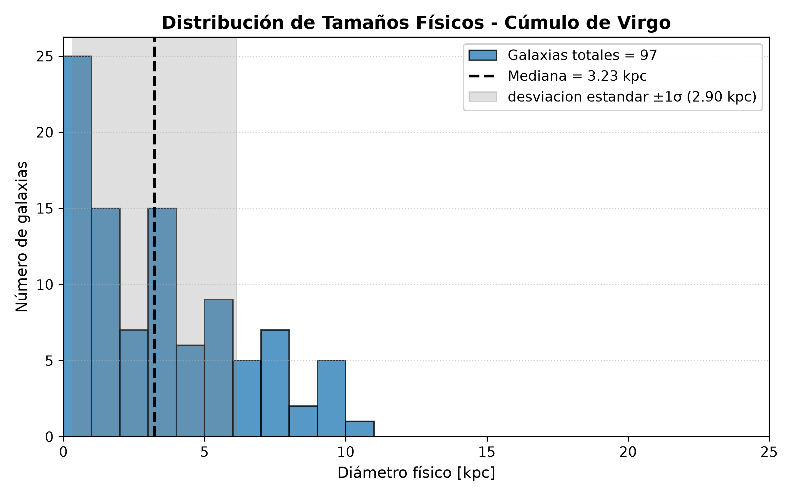
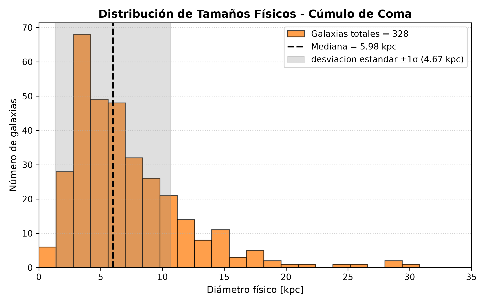
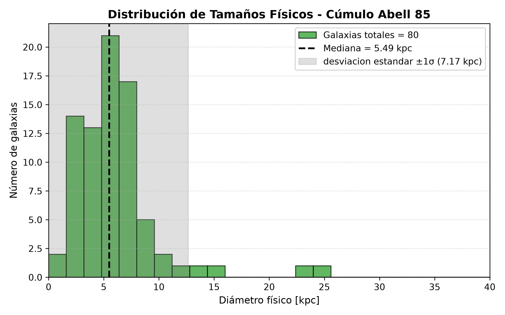
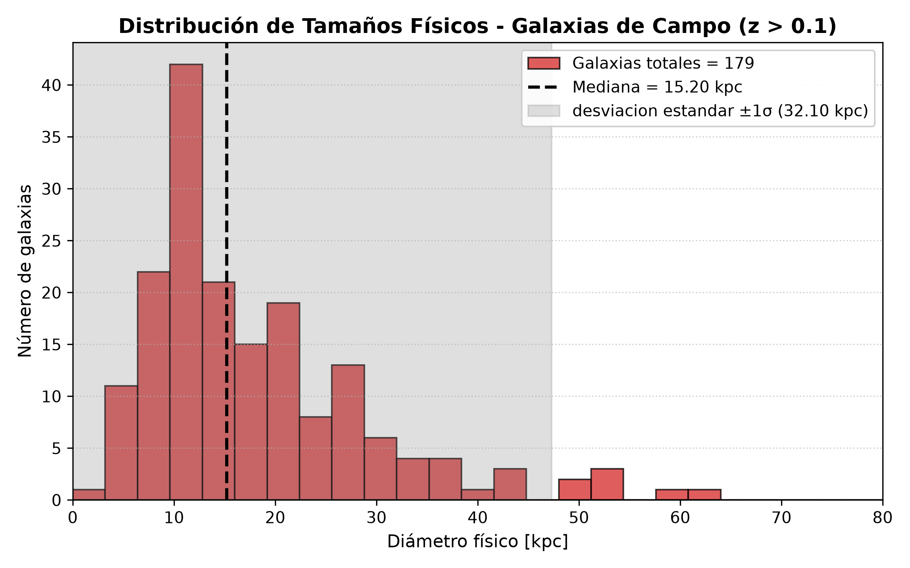
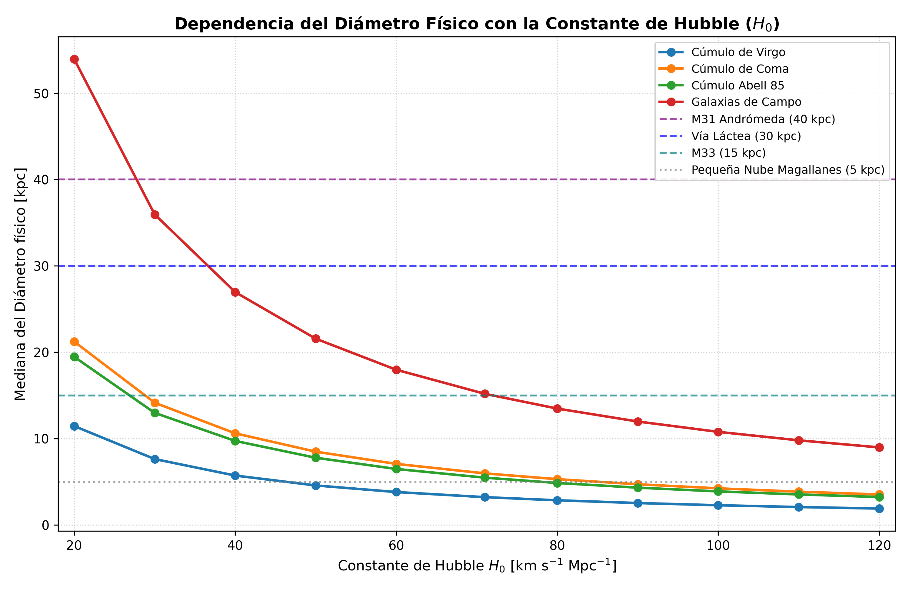

# extragalactic-scale-sdss-dr17
Measuring intrinsic physical diameters of cluster and field galaxies using SDSS DR17 to constrain the Hubble constant (H0).

# Extragalactic Physical Diameter Determination and $H_0$ Observational Constraints using SDSS DR17

[](https://www.python.org/)
[](https://www.astropy.org/)
[](https://www.sdss.org/dr17/)

## Overview
This repository contains the pipeline, SQL queries, and astrophysical analysis used to measure the intrinsic physical diameters of galaxies across distinct cosmic environments and redshift regimes. Using spectroscopic and photometric data from the **Sloan Digital Sky Survey Data Release 17 (SDSS DR17)**, we investigate environmental morphological evolution (ram pressure stripping, tidal harassment), assess observational selection effects (Malmquist bias), and place empirical constraints on the Hubble constant ($H_0$).

An extended scientific manuscript is available in [`report/extragalactic_galaxy_diameters_sdss.pdf`](report/).

---

## Cosmological Framework

Physical diameters ($d$) are determined from the observed de Vaucouleurs semilight/effective angular radii (`deVRad_r` in the SDSS $r$-band) and the cosmological angular diameter distance ($D_A$):

$$\theta = 2 \cdot \mathtt{deVRad\_r} \quad [\text{rad}]$$

$$d = \theta \cdot D_A(z) \quad [\text{kpc}]$$

Under a standard flat $\Lambda\text{CDM}$ metric:
* Reference Hubble constant: $H_0 = 71.0 \text{ km s}^{-1}\text{Mpc}^{-1}$
* Density parameters: $\Omega_M = 0.27$, $\Omega_\Lambda = 0.73$
* Line-of-sight comoving distance: 
  $$D_c(z) = \frac{c}{H_0} \int_0^z \frac{dz'}{\sqrt{\Omega_M(1+z')^3 + \Omega_\Lambda}}$$
* Angular diameter distance:
  $$D_A(z) = \frac{D_c(z)}{1+z}$$

Because $D_A \propto H_0^{-1}$, the derived physical diameter of extragalactic systems scales strictly inversely with the expansion rate: $d \propto H_0^{-1}$.

---

## Sample Selection

Samples were extracted from SDSS DR17 via SQL queries (`CasJobs`/`SkyServer`) linking `galaxy` photometry with `galSpecInfo` spectroscopy. Radial kinematic cuts were applied to clusters to eliminate foreground and background contaminants:

* **Virgo Cluster:** $z = 0.00360$, $\Delta v = 2000 \text{ km s}^{-1}$ ($N = 97$)
* **Coma Cluster (Abell 1656):** $z = 0.02310$, $\Delta v = 2000 \text{ km s}^{-1}$ ($N = 328$)
* **Abell 85:** $z = 0.05506$, $\Delta v = 3000 \text{ km s}^{-1}$ ($N = 80$)
* **Field Sample:** Background unbound field galaxies constrained to $z > 0.1000$ ($N = 179$)

---

## Statistical Results ($H_0 = 71 \text{ km s}^{-1}\text{Mpc}^{-1}$)

| Target | Nominal Redshift ($z$) | Sample Size ($N$) | Median Diameter [$\text{kpc}$] | Standard Deviation ($\sigma$) [$\text{kpc}$] |
| :--- | :---: | :---: | :---: | :---: |
| **Virgo Cluster** | 0.00360 | 97 | 3.23 | 2.90 |
| **Coma Cluster** | 0.02310 | 328 | 5.98 | 4.67 |
| **Abell 85** | 0.05506 | 80 | 5.49 | 7.17 |
| **Field Sample** | $> 0.1000$ | 179 | 15.20 | 32.10 |

<p align="center">
  
  
</p>
<p align="center">
  
  
</p>

### Key Astrophysical Findings
* **Cluster Quenching & Compaction:** Galaxies inside dense clusters show significantly smaller median diameters ($3.23\text{--}5.98\text{ kpc}$) compared to field galaxies. This reflects severe environmental processing: ram pressure stripping removes extended cold gas reservoirs, while high-velocity tidal encounters (harassment) truncate outer stellar envelopes.
* **Malmquist Selection Bias:** The high median size in the field sample ($15.20\text{ kpc}$) is dominated by spectroscopic flux-limit thresholds at $z > 0.1$. SDSS preferentially targets the high-luminosity tail of the luminosity function at higher redshifts, excluding faint dwarf systems that remain detectable in local clusters.

---

## Hubble Constant Sensitivity & Local Calibration

We varied $H_0$ across the parameter space $H_0 \in [20.0, \, 120.0] \text{ km s}^{-1}\text{Mpc}^{-1}$ and benchmarked the resulting median curves against independent, geometrically calibrated scales from the Local Group:
* **M31 (Andromeda):** $40 \text{ kpc}$
* **Milky Way:** $30 \text{ kpc}$
* **M33:** $15 \text{ kpc}$
* **Small Magellanic Cloud (SMC):** $5 \text{ kpc}$

<p align="center">
  
</p>

* **Lower Bound Rejection ($H_0 \le 30 \text{ km s}^{-1}\text{Mpc}^{-1}$):** Field galaxy medians inflate to $36\text{--}54 \text{ kpc}$, requiring typical field galaxies to be systematically larger than Andromeda—an unphysical scenario for non-cD disk galaxies.
* **Upper Bound Rejection ($H_0 \ge 100 \text{ km s}^{-1}\text{Mpc}^{-1}$):** Cluster medians fall below $2\text{--}4 \text{ kpc}$, reducing standard early-type galaxies to scales smaller than the SMC.
* **Empirical Allowed Interval:**
  $$\mathbf{H_0 \in [50.0, \, 85.0] \text{ km s}^{-1}\text{Mpc}^{-1}}$$
  This result successfully encompasses both the Planck CMB determination ($67.4 \pm 0.5 \text{ km s}^{-1}\text{Mpc}^{-1}$) and the local distance ladder SH0ES measurement ($73.04 \pm 1.04 \text{ km s}^{-1}\text{Mpc}^{-1}$).

---

## Pipeline Execution & Structure

```bash
├── data/              # SDSS DR17 CSV exports (virgo, coma, abell85, campo)
├── figuras/           # Output high-resolution distribution histograms & curves
├── report/            # Full scientific paper in PDF format
├── requirements.txt   # Python dependency specifications
├── punto1.py          # Data ingestion and catalog integrity checks
├── punto2.py          # Angular size conversions and cleaning
├── punto3.py          # Cosmological distance computations
├── punto4.py          # Size distributions and publication-grade histograms
└── punto5.py          # H0 sensitivity sweeps and Local Group benchmarking
```

### Reproducibility

To replicate the figures and metrics locally:

```bash
git clone [https://github.com/kevinantonioperezdiaz/extragalactic-scale-sdss-dr17.git](https://github.com/kevinantonioperezdiaz/extragalactic-scale-sdss-dr17.git)
cd extragalactic-scale-sdss-dr17
pip install -r requirements.txt
python punto4.py
python punto5.py
```
